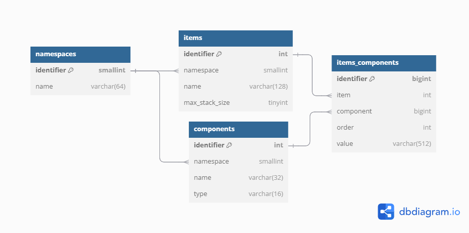

# Item Logger
Client-Side, Fabric Mod that logs container's contents to ``latest.log``.

## Log/Off Modes
All logging is disabled by default. The can be configured in the config-file.
Use ``/itemlogger mode log`` to enable logging to ``latest.log``;
use ``/itemlogger mode off`` to disable all logging.

## Database Mode
To use database-mode:
- First, you'll need a hosted database to connect to. (TODO: write link to db hosting section here)
- Then, your database credentials need to be written to the config-file.
- Finally, you'll be able to use "database" mode.
```
/itemlogger mode database
```
Also, you may set this to be the default mode upon start-up in the configurations ("DefaultMode").

TODO: write table for db hosting guides here

To use the database-mode for logging opened containers, your database may start as or will come to include (automatically) the above schema.

---


[Output Example](./images/ChestExample.md)

TODO: database example
