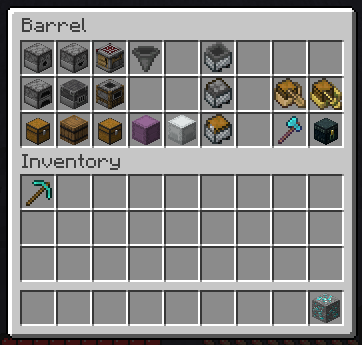

# Item Logger
Client-Side, Fabric Mod that logs container's contents to ``latest.log``.


<details open>
  <summary>Output Example</summary>
```
# "Barrel:
---
slot[0]:
	name = "Dispenser"
	amount: 1
	components:
		"minecraft:max_stack_size": 64
		"minecraft:lore": LoreComponent[lines=[], styledLines=[]]
		"minecraft:enchantments": ItemEnchantments{enchantments={}, showInTooltip=true}
		"minecraft:repair_cost": 0
		"minecraft:attribute_modifiers": AttributeModifiersComponent[modifiers=[], showInTooltip=true]
		"minecraft:rarity": COMMON
		"minecraft:container": net.minecraft.component.type.ContainerComponent@0
slot[1]:
	name = "Dropper"
	amount: 1
	components:
		"minecraft:max_stack_size": 64
		"minecraft:lore": LoreComponent[lines=[], styledLines=[]]
		"minecraft:enchantments": ItemEnchantments{enchantments={}, showInTooltip=true}
		"minecraft:repair_cost": 0
		"minecraft:attribute_modifiers": AttributeModifiersComponent[modifiers=[], showInTooltip=true]
		"minecraft:rarity": COMMON
		"minecraft:container": net.minecraft.component.type.ContainerComponent@0
slot[2]:
	name = "Crafter"
	amount: 1
	components:
		"minecraft:max_stack_size": 64
		"minecraft:lore": LoreComponent[lines=[], styledLines=[]]
		"minecraft:enchantments": ItemEnchantments{enchantments={}, showInTooltip=true}
		"minecraft:repair_cost": 0
		"minecraft:attribute_modifiers": AttributeModifiersComponent[modifiers=[], showInTooltip=true]
		"minecraft:rarity": COMMON
		"minecraft:container": net.minecraft.component.type.ContainerComponent@0
slot[3]:
	name = "Hopper"
	amount: 1
	components:
		"minecraft:max_stack_size": 64
		"minecraft:lore": LoreComponent[lines=[], styledLines=[]]
		"minecraft:enchantments": ItemEnchantments{enchantments={}, showInTooltip=true}
		"minecraft:repair_cost": 0
		"minecraft:attribute_modifiers": AttributeModifiersComponent[modifiers=[], showInTooltip=true]
		"minecraft:rarity": COMMON
		"minecraft:container": net.minecraft.component.type.ContainerComponent@0
slot[5]:
	name = "Minecart with Hopper"
	amount: 1
	components:
		"minecraft:max_stack_size": 1
		"minecraft:lore": LoreComponent[lines=[], styledLines=[]]
		"minecraft:enchantments": ItemEnchantments{enchantments={}, showInTooltip=true}
		"minecraft:repair_cost": 0
		"minecraft:attribute_modifiers": AttributeModifiersComponent[modifiers=[], showInTooltip=true]
		"minecraft:rarity": COMMON
slot[9]:
	name = "Furnace"
	amount: 1
	components:
		"minecraft:max_stack_size": 64
		"minecraft:lore": LoreComponent[lines=[], styledLines=[]]
		"minecraft:enchantments": ItemEnchantments{enchantments={}, showInTooltip=true}
		"minecraft:repair_cost": 0
		"minecraft:attribute_modifiers": AttributeModifiersComponent[modifiers=[], showInTooltip=true]
		"minecraft:rarity": COMMON
		"minecraft:container": net.minecraft.component.type.ContainerComponent@0
slot[10]:
	name = "Blast Furnace"
	amount: 1
	components:
		"minecraft:max_stack_size": 64
		"minecraft:lore": LoreComponent[lines=[], styledLines=[]]
		"minecraft:enchantments": ItemEnchantments{enchantments={}, showInTooltip=true}
		"minecraft:repair_cost": 0
		"minecraft:attribute_modifiers": AttributeModifiersComponent[modifiers=[], showInTooltip=true]
		"minecraft:rarity": COMMON
		"minecraft:container": net.minecraft.component.type.ContainerComponent@0
slot[11]:
	name = "Smoker"
	amount: 1
	components:
		"minecraft:max_stack_size": 64
		"minecraft:lore": LoreComponent[lines=[], styledLines=[]]
		"minecraft:enchantments": ItemEnchantments{enchantments={}, showInTooltip=true}
		"minecraft:repair_cost": 0
		"minecraft:attribute_modifiers": AttributeModifiersComponent[modifiers=[], showInTooltip=true]
		"minecraft:rarity": COMMON
		"minecraft:container": net.minecraft.component.type.ContainerComponent@0
slot[14]:
	name = "Minecart with Furnace"
	amount: 1
	components:
		"minecraft:max_stack_size": 1
		"minecraft:lore": LoreComponent[lines=[], styledLines=[]]
		"minecraft:enchantments": ItemEnchantments{enchantments={}, showInTooltip=true}
		"minecraft:repair_cost": 0
		"minecraft:attribute_modifiers": AttributeModifiersComponent[modifiers=[], showInTooltip=true]
		"minecraft:rarity": COMMON
slot[16]:
	name = "Oak Boat with Chest"
	amount: 1
	components:
		"minecraft:max_stack_size": 1
		"minecraft:lore": LoreComponent[lines=[], styledLines=[]]
		"minecraft:enchantments": ItemEnchantments{enchantments={}, showInTooltip=true}
		"minecraft:repair_cost": 0
		"minecraft:attribute_modifiers": AttributeModifiersComponent[modifiers=[], showInTooltip=true]
		"minecraft:rarity": COMMON
slot[17]:
	name = "Bamboo Raft with Chest"
	amount: 1
	components:
		"minecraft:max_stack_size": 1
		"minecraft:lore": LoreComponent[lines=[], styledLines=[]]
		"minecraft:enchantments": ItemEnchantments{enchantments={}, showInTooltip=true}
		"minecraft:repair_cost": 0
		"minecraft:attribute_modifiers": AttributeModifiersComponent[modifiers=[], showInTooltip=true]
		"minecraft:rarity": COMMON
slot[18]:
	name = "Chest"
	amount: 1
	components:
		"minecraft:max_stack_size": 64
		"minecraft:lore": LoreComponent[lines=[], styledLines=[]]
		"minecraft:enchantments": ItemEnchantments{enchantments={}, showInTooltip=true}
		"minecraft:repair_cost": 0
		"minecraft:attribute_modifiers": AttributeModifiersComponent[modifiers=[], showInTooltip=true]
		"minecraft:rarity": COMMON
		"minecraft:container": net.minecraft.component.type.ContainerComponent@0
slot[19]:
	name = "Barrel"
	amount: 1
	components:
		"minecraft:max_stack_size": 64
		"minecraft:lore": LoreComponent[lines=[], styledLines=[]]
		"minecraft:enchantments": ItemEnchantments{enchantments={}, showInTooltip=true}
		"minecraft:repair_cost": 0
		"minecraft:attribute_modifiers": AttributeModifiersComponent[modifiers=[], showInTooltip=true]
		"minecraft:rarity": COMMON
		"minecraft:container": net.minecraft.component.type.ContainerComponent@0
slot[20]:
	name = "Trapped Chest"
	amount: 1
	components:
		"minecraft:max_stack_size": 64
		"minecraft:lore": LoreComponent[lines=[], styledLines=[]]
		"minecraft:enchantments": ItemEnchantments{enchantments={}, showInTooltip=true}
		"minecraft:repair_cost": 0
		"minecraft:attribute_modifiers": AttributeModifiersComponent[modifiers=[], showInTooltip=true]
		"minecraft:rarity": COMMON
		"minecraft:container": net.minecraft.component.type.ContainerComponent@0
slot[21]:
	name = "Shulker Box"
	amount: 1
	components:
		"minecraft:max_stack_size": 1
		"minecraft:lore": LoreComponent[lines=[], styledLines=[]]
		"minecraft:enchantments": ItemEnchantments{enchantments={}, showInTooltip=true}
		"minecraft:repair_cost": 0
		"minecraft:attribute_modifiers": AttributeModifiersComponent[modifiers=[], showInTooltip=true]
		"minecraft:rarity": COMMON
		"minecraft:container": net.minecraft.component.type.ContainerComponent@0
slot[22]:
	name = "White Shulker Box"
	amount: 1
	components:
		"minecraft:max_stack_size": 1
		"minecraft:lore": LoreComponent[lines=[], styledLines=[]]
		"minecraft:enchantments": ItemEnchantments{enchantments={}, showInTooltip=true}
		"minecraft:repair_cost": 0
		"minecraft:attribute_modifiers": AttributeModifiersComponent[modifiers=[], showInTooltip=true]
		"minecraft:rarity": COMMON
		"minecraft:container": net.minecraft.component.type.ContainerComponent@0
slot[23]:
	name = "Minecart with Chest"
	amount: 1
	components:
		"minecraft:max_stack_size": 1
		"minecraft:lore": LoreComponent[lines=[], styledLines=[]]
		"minecraft:enchantments": ItemEnchantments{enchantments={}, showInTooltip=true}
		"minecraft:repair_cost": 0
		"minecraft:attribute_modifiers": AttributeModifiersComponent[modifiers=[], showInTooltip=true]
		"minecraft:rarity": COMMON
slot[25]:
	name = "Diamond Axe"
	amount: 1
	components:
		"minecraft:tool": ToolComponent[rules=[Rule[blocks=NamedSet(TagKey[minecraft:block / minecraft:incorrect_for_diamond_tool])[[]], speed=Optional.empty, correctForDrops=Optional[false]], Rule[blocks=NamedSet(TagKey[minecraft:block / minecraft:mineable/axe])[[Reference{ResourceKey[minecraft:block / minecraft:note_block]=Block{minecraft:note_block}}, Reference{ResourceKey[minecraft:block / minecraft:attached_melon_stem]=Block{minecraft:attached_melon_stem}}, Reference{ResourceKey[minecraft:block / minecraft:attached_pumpkin_stem]=Block{minecraft:attached_pumpkin_stem}}, Reference{ResourceKey[minecraft:block / minecraft:azalea]=Block{minecraft:azalea}}, Reference{ResourceKey[minecraft:block / minecraft:bamboo]=Block{minecraft:bamboo}}, Reference{ResourceKey[minecraft:block / minecraft:barrel]=Block{minecraft:barrel}}, Reference{ResourceKey[minecraft:block / minecraft:bee_nest]=Block{minecraft:bee_nest}}, Reference{ResourceKey[minecraft:block / minecraft:beehive]=Block{minecraft:beehive}}, Reference{ResourceKey[minecraft:block / minecraft:beetroots]=Block{minecraft:beetroots}}, Reference{ResourceKey[minecraft:block / minecraft:big_dripleaf_stem]=Block{minecraft:big_dripleaf_stem}}, Reference{ResourceKey[minecraft:block / minecraft:big_dripleaf]=Block{minecraft:big_dripleaf}}, Reference{ResourceKey[minecraft:block / minecraft:bookshelf]=Block{minecraft:bookshelf}}, Reference{ResourceKey[minecraft:block / minecraft:brown_mushroom_block]=Block{minecraft:brown_mushroom_block}}, Reference{ResourceKey[minecraft:block / minecraft:brown_mushroom]=Block{minecraft:brown_mushroom}}, Reference{ResourceKey[minecraft:block / minecraft:campfire]=Block{minecraft:campfire}}, Reference{ResourceKey[minecraft:block / minecraft:carrots]=Block{minecraft:carrots}}, Reference{ResourceKey[minecraft:block / minecraft:cartography_table]=Block{minecraft:cartography_table}}, Reference{ResourceKey[minecraft:block / minecraft:carved_pumpkin]=Block{minecraft:carved_pumpkin}}, Reference{ResourceKey[minecraft:block / minecraft:cave_vines_plant]=Block{minecraft:cave_vines_plant}}, Reference{ResourceKey[minecraft:block / minecraft:cave_vines]=Block{minecraft:cave_vines}}, Reference{ResourceKey[minecraft:block / minecraft:chest]=Block{minecraft:chest}}, Reference{ResourceKey[minecraft:block / minecraft:chorus_flower]=Block{minecraft:chorus_flower}}, Reference{ResourceKey[minecraft:block / minecraft:chorus_plant]=Block{minecraft:chorus_plant}}, Reference{ResourceKey[minecraft:block / minecraft:cocoa]=Block{minecraft:cocoa}}, Reference{ResourceKey[minecraft:block / minecraft:composter]=Block{minecraft:composter}}, Reference{ResourceKey[minecraft:block / minecraft:crafting_table]=Block{minecraft:crafting_table}}, Reference{ResourceKey[minecraft:block / minecraft:crimson_fungus]=Block{minecraft:crimson_fungus}}, Reference{ResourceKey[minecraft:block / minecraft:daylight_detector]=Block{minecraft:daylight_detector}}, Reference{ResourceKey[minecraft:block / minecraft:dead_bush]=Block{minecraft:dead_bush}}, Reference{ResourceKey[minecraft:block / minecraft:fern]=Block{minecraft:fern}}, Reference{ResourceKey[minecraft:block / minecraft:fletching_table]=Block{minecraft:fletching_table}}, Reference{ResourceKey[minecraft:block / minecraft:glow_lichen]=Block{minecraft:glow_lichen}}, Reference{ResourceKey[minecraft:block / minecraft:short_grass]=Block{minecraft:short_grass}}, Reference{ResourceKey[minecraft:block / minecraft:hanging_roots]=Block{minecraft:hanging_roots}}, Reference{ResourceKey[minecraft:block / minecraft:jack_o_lantern]=Block{minecraft:jack_o_lantern}}, Reference{ResourceKey[minecraft:block / minecraft:jukebox]=Block{minecraft:jukebox}}, Reference{ResourceKey[minecraft:block / minecraft:ladder]=Block{minecraft:ladder}}, Reference{ResourceKey[minecraft:block / minecraft:large_fern]=Block{minecraft:large_fern}}, Reference{ResourceKey[minecraft:block / minecraft:lectern]=Block{minecraft:lectern}}, Reference{ResourceKey[minecraft:block / minecraft:lily_pad]=Block{minecraft:lily_pad}}, Reference{ResourceKey[minecraft:block / minecraft:loom]=Block{minecraft:loom}}, Reference{ResourceKey[minecraft:block / minecraft:melon_stem]=Block{minecraft:melon_stem}}, Reference{ResourceKey[minecraft:block / minecraft:melon]=Block{minecraft:melon}}, Reference{ResourceKey[minecraft:block / minecraft:mushroom_stem]=Block{minecraft:mushroom_stem}}, Reference{ResourceKey[minecraft:block / minecraft:nether_wart]=Block{minecraft:nether_wart}}, Reference{ResourceKey[minecraft:block / minecraft:potatoes]=Block{minecraft:potatoes}}, Reference{ResourceKey[minecraft:block / minecraft:pumpkin_stem]=Block{minecraft:pumpkin_stem}}, Reference{ResourceKey[minecraft:block / minecraft:pumpkin]=Block{minecraft:pumpkin}}, Reference{ResourceKey[minecraft:block / minecraft:red_mushroom_block]=Block{minecraft:red_mushroom_block}}, Reference{ResourceKey[minecraft:block / minecraft:red_mushroom]=Block{minecraft:red_mushroom}}, Reference{ResourceKey[minecraft:block / minecraft:scaffolding]=Block{minecraft:scaffolding}}, Reference{ResourceKey[minecraft:block / minecraft:small_dripleaf]=Block{minecraft:small_dripleaf}}, Reference{ResourceKey[minecraft:block / minecraft:smithing_table]=Block{minecraft:smithing_table}}, Reference{ResourceKey[minecraft:block / minecraft:soul_campfire]=Block{minecraft:soul_campfire}}, Reference{ResourceKey[minecraft:block / minecraft:spore_blossom]=Block{minecraft:spore_blossom}}, Reference{ResourceKey[minecraft:block / minecraft:sugar_cane]=Block{minecraft:sugar_cane}}, Reference{ResourceKey[minecraft:block / minecraft:sweet_berry_bush]=Block{minecraft:sweet_berry_bush}}, Reference{ResourceKey[minecraft:block / minecraft:tall_grass]=Block{minecraft:tall_grass}}, Reference{ResourceKey[minecraft:block / minecraft:trapped_chest]=Block{minecraft:trapped_chest}}, Reference{ResourceKey[minecraft:block / minecraft:twisting_vines_plant]=Block{minecraft:twisting_vines_plant}}, Reference{ResourceKey[minecraft:block / minecraft:twisting_vines]=Block{minecraft:twisting_vines}}, Reference{ResourceKey[minecraft:block / minecraft:vine]=Block{minecraft:vine}}, Reference{ResourceKey[minecraft:block / minecraft:warped_fungus]=Block{minecraft:warped_fungus}}, Reference{ResourceKey[minecraft:block / minecraft:weeping_vines_plant]=Block{minecraft:weeping_vines_plant}}, Reference{ResourceKey[minecraft:block / minecraft:weeping_vines]=Block{minecraft:weeping_vines}}, Reference{ResourceKey[minecraft:block / minecraft:wheat]=Block{minecraft:wheat}}, Reference{ResourceKey[minecraft:block / minecraft:white_banner]=Block{minecraft:white_banner}}, Reference{ResourceKey[minecraft:block / minecraft:orange_banner]=Block{minecraft:orange_banner}}, Reference{ResourceKey[minecraft:block / minecraft:magenta_banner]=Block{minecraft:magenta_banner}}, Reference{ResourceKey[minecraft:block / minecraft:light_blue_banner]=Block{minecraft:light_blue_banner}}, Reference{ResourceKey[minecraft:block / minecraft:yellow_banner]=Block{minecraft:yellow_banner}}, Reference{ResourceKey[minecraft:block / minecraft:lime_banner]=Block{minecraft:lime_banner}}, Reference{ResourceKey[minecraft:block / minecraft:pink_banner]=Block{minecraft:pink_banner}}, Reference{ResourceKey[minecraft:block / minecraft:gray_banner]=Block{minecraft:gray_banner}}, Reference{ResourceKey[minecraft:block / minecraft:light_gray_banner]=Block{minecraft:light_gray_banner}}, Reference{ResourceKey[minecraft:block / minecraft:cyan_banner]=Block{minecraft:cyan_banner}}, Reference{ResourceKey[minecraft:block / minecraft:purple_banner]=Block{minecraft:purple_banner}}, Reference{ResourceKey[minecraft:block / minecraft:blue_banner]=Block{minecraft:blue_banner}}, Reference{ResourceKey[minecraft:block / minecraft:brown_banner]=Block{minecraft:brown_banner}}, Reference{ResourceKey[minecraft:block / minecraft:green_banner]=Block{minecraft:green_banner}}, Reference{ResourceKey[minecraft:block / minecraft:red_banner]=Block{minecraft:red_banner}}, Reference{ResourceKey[minecraft:block / minecraft:black_banner]=Block{minecraft:black_banner}}, Reference{ResourceKey[minecraft:block / minecraft:white_wall_banner]=Block{minecraft:white_wall_banner}}, Reference{ResourceKey[minecraft:block / minecraft:orange_wall_banner]=Block{minecraft:orange_wall_banner}}, Reference{ResourceKey[minecraft:block / minecraft:magenta_wall_banner]=Block{minecraft:magenta_wall_banner}}, Reference{ResourceKey[minecraft:block / minecraft:light_blue_wall_banner]=Block{minecraft:light_blue_wall_banner}}, Reference{ResourceKey[minecraft:block / minecraft:yellow_wall_banner]=Block{minecraft:yellow_wall_banner}}, Reference{ResourceKey[minecraft:block / minecraft:lime_wall_banner]=Block{minecraft:lime_wall_banner}}, Reference{ResourceKey[minecraft:block / minecraft:pink_wall_banner]=Block{minecraft:pink_wall_banner}}, Reference{ResourceKey[minecraft:block / minecraft:gray_wall_banner]=Block{minecraft:gray_wall_banner}}, Reference{ResourceKey[minecraft:block / minecraft:light_gray_wall_banner]=Block{minecraft:light_gray_wall_banner}}, Reference{ResourceKey[minecraft:block / minecraft:cyan_wall_banner]=Block{minecraft:cyan_wall_banner}}, Reference{ResourceKey[minecraft:block / minecraft:purple_wall_banner]=Block{minecraft:purple_wall_banner}}, Reference{ResourceKey[minecraft:block / minecraft:blue_wall_banner]=Block{minecraft:blue_wall_banner}}, Reference{ResourceKey[minecraft:block / minecraft:brown_wall_banner]=Block{minecraft:brown_wall_banner}}, Reference{ResourceKey[minecraft:block / minecraft:green_wall_banner]=Block{minecraft:green_wall_banner}}, Reference{ResourceKey[minecraft:block / minecraft:red_wall_banner]=Block{minecraft:red_wall_banner}}, Reference{ResourceKey[minecraft:block / minecraft:black_wall_banner]=Block{minecraft:black_wall_banner}}, Reference{ResourceKey[minecraft:block / minecraft:acacia_fence_gate]=Block{minecraft:acacia_fence_gate}}, Reference{ResourceKey[minecraft:block / minecraft:birch_fence_gate]=Block{minecraft:birch_fence_gate}}, Reference{ResourceKey[minecraft:block / minecraft:dark_oak_fence_gate]=Block{minecraft:dark_oak_fence_gate}}, Reference{ResourceKey[minecraft:block / minecraft:jungle_fence_gate]=Block{minecraft:jungle_fence_gate}}, Reference{ResourceKey[minecraft:block / minecraft:oak_fence_gate]=Block{minecraft:oak_fence_gate}}, Reference{ResourceKey[minecraft:block / minecraft:spruce_fence_gate]=Block{minecraft:spruce_fence_gate}}, Reference{ResourceKey[minecraft:block / minecraft:crimson_fence_gate]=Block{minecraft:crimson_fence_gate}}, Reference{ResourceKey[minecraft:block / minecraft:warped_fence_gate]=Block{minecraft:warped_fence_gate}}, Reference{ResourceKey[minecraft:block / minecraft:mangrove_fence_gate]=Block{minecraft:mangrove_fence_gate}}, Reference{ResourceKey[minecraft:block / minecraft:bamboo_fence_gate]=Block{minecraft:bamboo_fence_gate}}, Reference{ResourceKey[minecraft:block / minecraft:cherry_fence_gate]=Block{minecraft:cherry_fence_gate}}, Reference{ResourceKey[minecraft:block / minecraft:dark_oak_log]=Block{minecraft:dark_oak_log}}, Reference{ResourceKey[minecraft:block / minecraft:dark_oak_wood]=Block{minecraft:dark_oak_wood}}, Reference{ResourceKey[minecraft:block / minecraft:stripped_dark_oak_log]=Block{minecraft:stripped_dark_oak_log}}, Reference{ResourceKey[minecraft:block / minecraft:stripped_dark_oak_wood]=Block{minecraft:stripped_dark_oak_wood}}, Reference{ResourceKey[minecraft:block / minecraft:oak_log]=Block{minecraft:oak_log}}, Reference{ResourceKey[minecraft:block / minecraft:oak_wood]=Block{minecraft:oak_wood}}, Reference{ResourceKey[minecraft:block / minecraft:stripped_oak_log]=Block{minecraft:stripped_oak_log}}, Reference{ResourceKey[minecraft:block / minecraft:stripped_oak_wood]=Block{minecraft:stripped_oak_wood}}, Reference{ResourceKey[minecraft:block / minecraft:acacia_log]=Block{minecraft:acacia_log}}, Reference{ResourceKey[minecraft:block / minecraft:acacia_wood]=Block{minecraft:acacia_wood}}, Reference{ResourceKey[minecraft:block / minecraft:stripped_acacia_log]=Block{minecraft:stripped_acacia_log}}, Reference{ResourceKey[minecraft:block / minecraft:stripped_acacia_wood]=Block{minecraft:stripped_acacia_wood}}, Reference{ResourceKey[minecraft:block / minecraft:birch_log]=Block{minecraft:birch_log}}, Reference{ResourceKey[minecraft:block / minecraft:birch_wood]=Block{minecraft:birch_wood}}, Reference{ResourceKey[minecraft:block / minecraft:stripped_birch_log]=Block{minecraft:stripped_birch_log}}, Reference{ResourceKey[minecraft:block / minecraft:stripped_birch_wood]=Block{minecraft:stripped_birch_wood}}, Reference{ResourceKey[minecraft:block / minecraft:jungle_log]=Block{minecraft:jungle_log}}, Reference{ResourceKey[minecraft:block / minecraft:jungle_wood]=Block{minecraft:jungle_wood}}, Reference{ResourceKey[minecraft:block / minecraft:stripped_jungle_log]=Block{minecraft:stripped_jungle_log}}, Reference{ResourceKey[minecraft:block / minecraft:stripped_jungle_wood]=Block{minecraft:stripped_jungle_wood}}, Reference{ResourceKey[minecraft:block / minecraft:spruce_log]=Block{minecraft:spruce_log}}, Reference{ResourceKey[minecraft:block / minecraft:spruce_wood]=Block{minecraft:spruce_wood}}, Reference{ResourceKey[minecraft:block / minecraft:stripped_spruce_log]=Block{minecraft:stripped_spruce_log}}, Reference{ResourceKey[minecraft:block / minecraft:stripped_spruce_wood]=Block{minecraft:stripped_spruce_wood}}, Reference{ResourceKey[minecraft:block / minecraft:mangrove_log]=Block{minecraft:mangrove_log}}, Reference{ResourceKey[minecraft:block / minecraft:mangrove_wood]=Block{minecraft:mangrove_wood}}, Reference{ResourceKey[minecraft:block / minecraft:stripped_mangrove_log]=Block{minecraft:stripped_mangrove_log}}, Reference{ResourceKey[minecraft:block / minecraft:stripped_mangrove_wood]=Block{minecraft:stripped_mangrove_wood}}, Reference{ResourceKey[minecraft:block / minecraft:cherry_log]=Block{minecraft:cherry_log}}, Reference{ResourceKey[minecraft:block / minecraft:cherry_wood]=Block{minecraft:cherry_wood}}, Reference{ResourceKey[minecraft:block / minecraft:stripped_cherry_log]=Block{minecraft:stripped_cherry_log}}, Reference{ResourceKey[minecraft:block / minecraft:stripped_cherry_wood]=Block{minecraft:stripped_cherry_wood}}, Reference{ResourceKey[minecraft:block / minecraft:crimson_stem]=Block{minecraft:crimson_stem}}, Reference{ResourceKey[minecraft:block / minecraft:stripped_crimson_stem]=Block{minecraft:stripped_crimson_stem}}, Reference{ResourceKey[minecraft:block / minecraft:crimson_hyphae]=Block{minecraft:crimson_hyphae}}, Reference{ResourceKey[minecraft:block / minecraft:stripped_crimson_hyphae]=Block{minecraft:stripped_crimson_hyphae}}, Reference{ResourceKey[minecraft:block / minecraft:warped_stem]=Block{minecraft:warped_stem}}, Reference{ResourceKey[minecraft:block / minecraft:stripped_warped_stem]=Block{minecraft:stripped_warped_stem}}, Reference{ResourceKey[minecraft:block / minecraft:warped_hyphae]=Block{minecraft:warped_hyphae}}, Reference{ResourceKey[minecraft:block / minecraft:stripped_warped_hyphae]=Block{minecraft:stripped_warped_hyphae}}, Reference{ResourceKey[minecraft:block / minecraft:oak_planks]=Block{minecraft:oak_planks}}, Reference{ResourceKey[minecraft:block / minecraft:spruce_planks]=Block{minecraft:spruce_planks}}, Reference{ResourceKey[minecraft:block / minecraft:birch_planks]=Block{minecraft:birch_planks}}, Reference{ResourceKey[minecraft:block / minecraft:jungle_planks]=Block{minecraft:jungle_planks}}, Reference{ResourceKey[minecraft:block / minecraft:acacia_planks]=Block{minecraft:acacia_planks}}, Reference{ResourceKey[minecraft:block / minecraft:dark_oak_planks]=Block{minecraft:dark_oak_planks}}, Reference{ResourceKey[minecraft:block / minecraft:crimson_planks]=Block{minecraft:crimson_planks}}, Reference{ResourceKey[minecraft:block / minecraft:warped_planks]=Block{minecraft:warped_planks}}, Reference{ResourceKey[minecraft:block / minecraft:mangrove_planks]=Block{minecraft:mangrove_planks}}, Reference{ResourceKey[minecraft:block / minecraft:bamboo_planks]=Block{minecraft:bamboo_planks}}, Reference{ResourceKey[minecraft:block / minecraft:cherry_planks]=Block{minecraft:cherry_planks}}, Reference{ResourceKey[minecraft:block / minecraft:oak_sapling]=Block{minecraft:oak_sapling}}, Reference{ResourceKey[minecraft:block / minecraft:spruce_sapling]=Block{minecraft:spruce_sapling}}, Reference{ResourceKey[minecraft:block / minecraft:birch_sapling]=Block{minecraft:birch_sapling}}, Reference{ResourceKey[minecraft:block / minecraft:jungle_sapling]=Block{minecraft:jungle_sapling}}, Reference{ResourceKey[minecraft:block / minecraft:acacia_sapling]=Block{minecraft:acacia_sapling}}, Reference{ResourceKey[minecraft:block / minecraft:dark_oak_sapling]=Block{minecraft:dark_oak_sapling}}, Reference{ResourceKey[minecraft:block / minecraft:flowering_azalea]=Block{minecraft:flowering_azalea}}, Reference{ResourceKey[minecraft:block / minecraft:mangrove_propagule]=Block{minecraft:mangrove_propagule}}, Reference{ResourceKey[minecraft:block / minecraft:cherry_sapling]=Block{minecraft:cherry_sapling}}, Reference{ResourceKey[minecraft:block / minecraft:oak_sign]=Block{minecraft:oak_sign}}, Reference{ResourceKey[minecraft:block / minecraft:spruce_sign]=Block{minecraft:spruce_sign}}, Reference{ResourceKey[minecraft:block / minecraft:birch_sign]=Block{minecraft:birch_sign}}, Reference{ResourceKey[minecraft:block / minecraft:acacia_sign]=Block{minecraft:acacia_sign}}, Reference{ResourceKey[minecraft:block / minecraft:jungle_sign]=Block{minecraft:jungle_sign}}, Reference{ResourceKey[minecraft:block / minecraft:dark_oak_sign]=Block{minecraft:dark_oak_sign}}, Reference{ResourceKey[minecraft:block / minecraft:crimson_sign]=Block{minecraft:crimson_sign}}, Reference{ResourceKey[minecraft:block / minecraft:warped_sign]=Block{minecraft:warped_sign}}, Reference{ResourceKey[minecraft:block / minecraft:mangrove_sign]=Block{minecraft:mangrove_sign}}, Reference{ResourceKey[minecraft:block / minecraft:bamboo_sign]=Block{minecraft:bamboo_sign}}, Reference{ResourceKey[minecraft:block / minecraft:cherry_sign]=Block{minecraft:cherry_sign}}, Reference{ResourceKey[minecraft:block / minecraft:oak_wall_sign]=Block{minecraft:oak_wall_sign}}, Reference{ResourceKey[minecraft:block / minecraft:spruce_wall_sign]=Block{minecraft:spruce_wall_sign}}, Reference{ResourceKey[minecraft:block / minecraft:birch_wall_sign]=Block{minecraft:birch_wall_sign}}, Reference{ResourceKey[minecraft:block / minecraft:acacia_wall_sign]=Block{minecraft:acacia_wall_sign}}, Reference{ResourceKey[minecraft:block / minecraft:jungle_wall_sign]=Block{minecraft:jungle_wall_sign}}, Reference{ResourceKey[minecraft:block / minecraft:dark_oak_wall_sign]=Block{minecraft:dark_oak_wall_sign}}, Reference{ResourceKey[minecraft:block / minecraft:crimson_wall_sign]=Block{minecraft:crimson_wall_sign}}, Reference{ResourceKey[minecraft:block / minecraft:warped_wall_sign]=Block{minecraft:warped_wall_sign}}, Reference{ResourceKey[minecraft:block / minecraft:mangrove_wall_sign]=Block{minecraft:mangrove_wall_sign}}, Reference{ResourceKey[minecraft:block / minecraft:bamboo_wall_sign]=Block{minecraft:bamboo_wall_sign}}, Reference{ResourceKey[minecraft:block / minecraft:cherry_wall_sign]=Block{minecraft:cherry_wall_sign}}, Reference{ResourceKey[minecraft:block / minecraft:oak_button]=Block{minecraft:oak_button}}, Reference{ResourceKey[minecraft:block / minecraft:spruce_button]=Block{minecraft:spruce_button}}, Reference{ResourceKey[minecraft:block / minecraft:birch_button]=Block{minecraft:birch_button}}, Reference{ResourceKey[minecraft:block / minecraft:jungle_button]=Block{minecraft:jungle_button}}, Reference{ResourceKey[minecraft:block / minecraft:acacia_button]=Block{minecraft:acacia_button}}, Reference{ResourceKey[minecraft:block / minecraft:dark_oak_button]=Block{minecraft:dark_oak_button}}, Reference{ResourceKey[minecraft:block / minecraft:crimson_button]=Block{minecraft:crimson_button}}, Reference{ResourceKey[minecraft:block / minecraft:warped_button]=Block{minecraft:warped_button}}, Reference{ResourceKey[minecraft:block / minecraft:mangrove_button]=Block{minecraft:mangrove_button}}, Reference{ResourceKey[minecraft:block / minecraft:bamboo_button]=Block{minecraft:bamboo_button}}, Reference{ResourceKey[minecraft:block / minecraft:cherry_button]=Block{minecraft:cherry_button}}, Reference{ResourceKey[minecraft:block / minecraft:oak_door]=Block{minecraft:oak_door}}, Reference{ResourceKey[minecraft:block / minecraft:spruce_door]=Block{minecraft:spruce_door}}, Reference{ResourceKey[minecraft:block / minecraft:birch_door]=Block{minecraft:birch_door}}, Reference{ResourceKey[minecraft:block / minecraft:jungle_door]=Block{minecraft:jungle_door}}, Reference{ResourceKey[minecraft:block / minecraft:acacia_door]=Block{minecraft:acacia_door}}, Reference{ResourceKey[minecraft:block / minecraft:dark_oak_door]=Block{minecraft:dark_oak_door}}, Reference{ResourceKey[minecraft:block / minecraft:crimson_door]=Block{minecraft:crimson_door}}, Reference{ResourceKey[minecraft:block / minecraft:warped_door]=Block{minecraft:warped_door}}, Reference{ResourceKey[minecraft:block / minecraft:mangrove_door]=Block{minecraft:mangrove_door}}, Reference{ResourceKey[minecraft:block / minecraft:bamboo_door]=Block{minecraft:bamboo_door}}, Reference{ResourceKey[minecraft:block / minecraft:cherry_door]=Block{minecraft:cherry_door}}, Reference{ResourceKey[minecraft:block / minecraft:oak_fence]=Block{minecraft:oak_fence}}, Reference{ResourceKey[minecraft:block / minecraft:acacia_fence]=Block{minecraft:acacia_fence}}, Reference{ResourceKey[minecraft:block / minecraft:dark_oak_fence]=Block{minecraft:dark_oak_fence}}, Reference{ResourceKey[minecraft:block / minecraft:spruce_fence]=Block{minecraft:spruce_fence}}, Reference{ResourceKey[minecraft:block / minecraft:birch_fence]=Block{minecraft:birch_fence}}, Reference{ResourceKey[minecraft:block / minecraft:jungle_fence]=Block{minecraft:jungle_fence}}, Reference{ResourceKey[minecraft:block / minecraft:crimson_fence]=Block{minecraft:crimson_fence}}, Reference{ResourceKey[minecraft:block / minecraft:warped_fence]=Block{minecraft:warped_fence}}, Reference{ResourceKey[minecraft:block / minecraft:mangrove_fence]=Block{minecraft:mangrove_fence}}, Reference{ResourceKey[minecraft:block / minecraft:bamboo_fence]=Block{minecraft:bamboo_fence}}, Reference{ResourceKey[minecraft:block / minecraft:cherry_fence]=Block{minecraft:cherry_fence}}, Reference{ResourceKey[minecraft:block / minecraft:oak_pressure_plate]=Block{minecraft:oak_pressure_plate}}, Reference{ResourceKey[minecraft:block / minecraft:spruce_pressure_plate]=Block{minecraft:spruce_pressure_plate}}, Reference{ResourceKey[minecraft:block / minecraft:birch_pressure_plate]=Block{minecraft:birch_pressure_plate}}, Reference{ResourceKey[minecraft:block / minecraft:jungle_pressure_plate]=Block{minecraft:jungle_pressure_plate}}, Reference{ResourceKey[minecraft:block / minecraft:acacia_pressure_plate]=Block{minecraft:acacia_pressure_plate}}, Reference{ResourceKey[minecraft:block / minecraft:dark_oak_pressure_plate]=Block{minecraft:dark_oak_pressure_plate}}, Reference{ResourceKey[minecraft:block / minecraft:crimson_pressure_plate]=Block{minecraft:crimson_pressure_plate}}, Reference{ResourceKey[minecraft:block / minecraft:warped_pressure_plate]=Block{minecraft:warped_pressure_plate}}, Reference{ResourceKey[minecraft:block / minecraft:mangrove_pressure_plate]=Block{minecraft:mangrove_pressure_plate}}, Reference{ResourceKey[minecraft:block / minecraft:bamboo_pressure_plate]=Block{minecraft:bamboo_pressure_plate}}, Reference{ResourceKey[minecraft:block / minecraft:cherry_pressure_plate]=Block{minecraft:cherry_pressure_plate}}, Reference{ResourceKey[minecraft:block / minecraft:oak_slab]=Block{minecraft:oak_slab}}, Reference{ResourceKey[minecraft:block / minecraft:spruce_slab]=Block{minecraft:spruce_slab}}, Reference{ResourceKey[minecraft:block / minecraft:birch_slab]=Block{minecraft:birch_slab}}, Reference{ResourceKey[minecraft:block / minecraft:jungle_slab]=Block{minecraft:jungle_slab}}, Reference{ResourceKey[minecraft:block / minecraft:acacia_slab]=Block{minecraft:acacia_slab}}, Reference{ResourceKey[minecraft:block / minecraft:dark_oak_slab]=Block{minecraft:dark_oak_slab}}, Reference{ResourceKey[minecraft:block / minecraft:crimson_slab]=Block{minecraft:crimson_slab}}, Reference{ResourceKey[minecraft:block / minecraft:warped_slab]=Block{minecraft:warped_slab}}, Reference{ResourceKey[minecraft:block / minecraft:mangrove_slab]=Block{minecraft:mangrove_slab}}, Reference{ResourceKey[minecraft:block / minecraft:bamboo_slab]=Block{minecraft:bamboo_slab}}, Reference{ResourceKey[minecraft:block / minecraft:cherry_slab]=Block{minecraft:cherry_slab}}, Reference{ResourceKey[minecraft:block / minecraft:oak_stairs]=Block{minecraft:oak_stairs}}, Reference{ResourceKey[minecraft:block / minecraft:spruce_stairs]=Block{minecraft:spruce_stairs}}, Reference{ResourceKey[minecraft:block / minecraft:birch_stairs]=Block{minecraft:birch_stairs}}, Reference{ResourceKey[minecraft:block / minecraft:jungle_stairs]=Block{minecraft:jungle_stairs}}, Reference{ResourceKey[minecraft:block / minecraft:acacia_stairs]=Block{minecraft:acacia_stairs}}, Reference{ResourceKey[minecraft:block / minecraft:dark_oak_stairs]=Block{minecraft:dark_oak_stairs}}, Reference{ResourceKey[minecraft:block / minecraft:crimson_stairs]=Block{minecraft:crimson_stairs}}, Reference{ResourceKey[minecraft:block / minecraft:warped_stairs]=Block{minecraft:warped_stairs}}, Reference{ResourceKey[minecraft:block / minecraft:mangrove_stairs]=Block{minecraft:mangrove_stairs}}, Reference{ResourceKey[minecraft:block / minecraft:bamboo_stairs]=Block{minecraft:bamboo_stairs}}, Reference{ResourceKey[minecraft:block / minecraft:cherry_stairs]=Block{minecraft:cherry_stairs}}, Reference{ResourceKey[minecraft:block / minecraft:acacia_trapdoor]=Block{minecraft:acacia_trapdoor}}, Reference{ResourceKey[minecraft:block / minecraft:birch_trapdoor]=Block{minecraft:birch_trapdoor}}, Reference{ResourceKey[minecraft:block / minecraft:dark_oak_trapdoor]=Block{minecraft:dark_oak_trapdoor}}, Reference{ResourceKey[minecraft:block / minecraft:jungle_trapdoor]=Block{minecraft:jungle_trapdoor}}, Reference{ResourceKey[minecraft:block / minecraft:oak_trapdoor]=Block{minecraft:oak_trapdoor}}, Reference{ResourceKey[minecraft:block / minecraft:spruce_trapdoor]=Block{minecraft:spruce_trapdoor}}, Reference{ResourceKey[minecraft:block / minecraft:crimson_trapdoor]=Block{minecraft:crimson_trapdoor}}, Reference{ResourceKey[minecraft:block / minecraft:warped_trapdoor]=Block{minecraft:warped_trapdoor}}, Reference{ResourceKey[minecraft:block / minecraft:mangrove_trapdoor]=Block{minecraft:mangrove_trapdoor}}, Reference{ResourceKey[minecraft:block / minecraft:bamboo_trapdoor]=Block{minecraft:bamboo_trapdoor}}, Reference{ResourceKey[minecraft:block / minecraft:cherry_trapdoor]=Block{minecraft:cherry_trapdoor}}, Reference{ResourceKey[minecraft:block / minecraft:mangrove_roots]=Block{minecraft:mangrove_roots}}, Reference{ResourceKey[minecraft:block / minecraft:oak_hanging_sign]=Block{minecraft:oak_hanging_sign}}, Reference{ResourceKey[minecraft:block / minecraft:spruce_hanging_sign]=Block{minecraft:spruce_hanging_sign}}, Reference{ResourceKey[minecraft:block / minecraft:birch_hanging_sign]=Block{minecraft:birch_hanging_sign}}, Reference{ResourceKey[minecraft:block / minecraft:acacia_hanging_sign]=Block{minecraft:acacia_hanging_sign}}, Reference{ResourceKey[minecraft:block / minecraft:cherry_hanging_sign]=Block{minecraft:cherry_hanging_sign}}, Reference{ResourceKey[minecraft:block / minecraft:jungle_hanging_sign]=Block{minecraft:jungle_hanging_sign}}, Reference{ResourceKey[minecraft:block / minecraft:dark_oak_hanging_sign]=Block{minecraft:dark_oak_hanging_sign}}, Reference{ResourceKey[minecraft:block / minecraft:crimson_hanging_sign]=Block{minecraft:crimson_hanging_sign}}, Reference{ResourceKey[minecraft:block / minecraft:warped_hanging_sign]=Block{minecraft:warped_hanging_sign}}, Reference{ResourceKey[minecraft:block / minecraft:mangrove_hanging_sign]=Block{minecraft:mangrove_hanging_sign}}, Reference{ResourceKey[minecraft:block / minecraft:bamboo_hanging_sign]=Block{minecraft:bamboo_hanging_sign}}, Reference{ResourceKey[minecraft:block / minecraft:oak_wall_hanging_sign]=Block{minecraft:oak_wall_hanging_sign}}, Reference{ResourceKey[minecraft:block / minecraft:spruce_wall_hanging_sign]=Block{minecraft:spruce_wall_hanging_sign}}, Reference{ResourceKey[minecraft:block / minecraft:birch_wall_hanging_sign]=Block{minecraft:birch_wall_hanging_sign}}, Reference{ResourceKey[minecraft:block / minecraft:acacia_wall_hanging_sign]=Block{minecraft:acacia_wall_hanging_sign}}, Reference{ResourceKey[minecraft:block / minecraft:cherry_wall_hanging_sign]=Block{minecraft:cherry_wall_hanging_sign}}, Reference{ResourceKey[minecraft:block / minecraft:jungle_wall_hanging_sign]=Block{minecraft:jungle_wall_hanging_sign}}, Reference{ResourceKey[minecraft:block / minecraft:dark_oak_wall_hanging_sign]=Block{minecraft:dark_oak_wall_hanging_sign}}, Reference{ResourceKey[minecraft:block / minecraft:crimson_wall_hanging_sign]=Block{minecraft:crimson_wall_hanging_sign}}, Reference{ResourceKey[minecraft:block / minecraft:warped_wall_hanging_sign]=Block{minecraft:warped_wall_hanging_sign}}, Reference{ResourceKey[minecraft:block / minecraft:mangrove_wall_hanging_sign]=Block{minecraft:mangrove_wall_hanging_sign}}, Reference{ResourceKey[minecraft:block / minecraft:bamboo_wall_hanging_sign]=Block{minecraft:bamboo_wall_hanging_sign}}, Reference{ResourceKey[minecraft:block / minecraft:bamboo_mosaic]=Block{minecraft:bamboo_mosaic}}, Reference{ResourceKey[minecraft:block / minecraft:bamboo_mosaic_slab]=Block{minecraft:bamboo_mosaic_slab}}, Reference{ResourceKey[minecraft:block / minecraft:bamboo_mosaic_stairs]=Block{minecraft:bamboo_mosaic_stairs}}, Reference{ResourceKey[minecraft:block / minecraft:bamboo_block]=Block{minecraft:bamboo_block}}, Reference{ResourceKey[minecraft:block / minecraft:stripped_bamboo_block]=Block{minecraft:stripped_bamboo_block}}, Reference{ResourceKey[minecraft:block / minecraft:chiseled_bookshelf]=Block{minecraft:chiseled_bookshelf}}]], speed=Optional[8.0], correctForDrops=Optional[true]]], defaultMiningSpeed=1.0, damagePerBlock=1]
		"minecraft:enchantments": ItemEnchantments{enchantments={Reference{ResourceKey[minecraft:enchantment / minecraft:bane_of_arthropods]=Enchantment Bane of Arthropods}=>5}, showInTooltip=true}
		"minecraft:repair_cost": 0
		"minecraft:damage": 0
		"minecraft:attribute_modifiers": AttributeModifiersComponent[modifiers=[Entry[attribute=Reference{ResourceKey[minecraft:attribute / minecraft:generic.attack_damage]=net.minecraft.entity.attribute.ClampedEntityAttribute@e2f6e13}, modifier=EntityAttributeModifier[id=minecraft:base_attack_damage, amount=8.0, operation=ADD_VALUE], slot=MAINHAND], Entry[attribute=Reference{ResourceKey[minecraft:attribute / minecraft:generic.attack_speed]=net.minecraft.entity.attribute.ClampedEntityAttribute@533d7c61}, modifier=EntityAttributeModifier[id=minecraft:base_attack_speed, amount=-3.0, operation=ADD_VALUE], slot=MAINHAND]], showInTooltip=true]
		"minecraft:max_stack_size": 1
		"minecraft:rarity": COMMON
		"minecraft:max_damage": 1561
		"minecraft:lore": LoreComponent[lines=[], styledLines=[]]
slot[26]:
	name = "Ender Chest"
	amount: 1
	components:
		"minecraft:max_stack_size": 64
		"minecraft:lore": LoreComponent[lines=[], styledLines=[]]
		"minecraft:enchantments": ItemEnchantments{enchantments={}, showInTooltip=true}
		"minecraft:repair_cost": 0
		"minecraft:attribute_modifiers": AttributeModifiersComponent[modifiers=[], showInTooltip=true]
		"minecraft:rarity": COMMON
		"minecraft:container": net.minecraft.component.type.ContainerComponent@0
```
</details>
