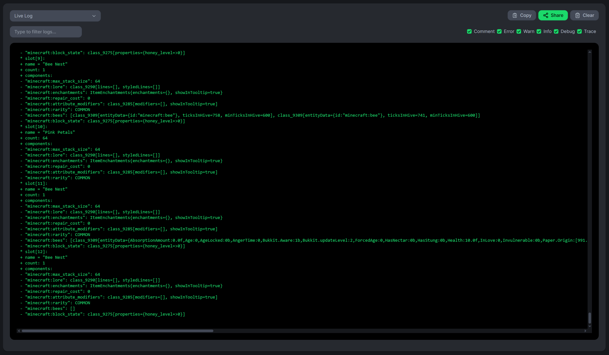

# Item Logger
Client-Side, Fabric Mod that logs container's contents to ``latest.log``.

All logging is disabled by default.
Use ``/itemlogger mode log`` to enable logging to ``latest.log``;
yse ``/itemlogger mode off`` to disable all logging.

[Output Example](./images/ChestExample.md)
